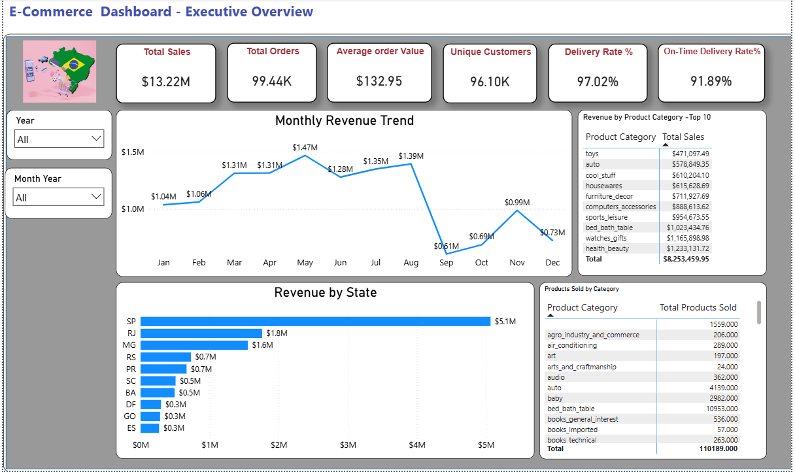
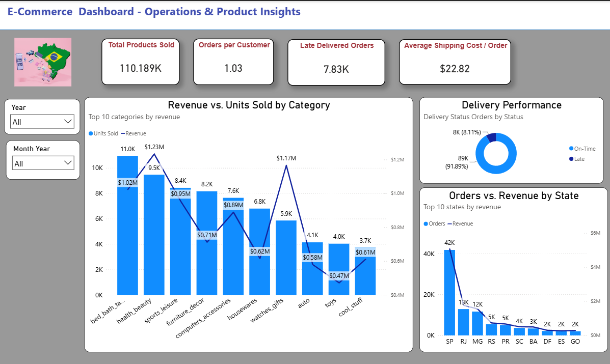

# Brazilian-Ecommerce-PowerBI
# 🇧🇷 Brazilian E-Commerce Analytics | Power BI

## 📊 Project Overview

An interactive Power BI dashboard developed to analyze sales performance,
customer behavior, product performance, geographic distribution, and
delivery operations for a Brazilian e-commerce business.

The project demonstrates end-to-end Power BI capabilities including
data modeling, DAX, Power Query, KPI development, relationship
management, and business-focused data visualization.

---

## 🛠️ Tools & Technologies

- Power BI
- DAX
- Power Query
- Data Modeling
- Excel / CSV
- GitHub

---

## 📈 Dashboard

### Executive Overview

### Product & Operations Insights

---

## 🎯 Key KPIs

| KPI | Result |
|---|---:|
| Total Sales | $13.22M |
| Total Orders | 99.44K |
| Average Order Value | $132.95 |
| Unique Customers | 96.10K |
| Orders per Customer | 1.03 |
| Delivery Rate | 97.02% |
| On-Time Delivery Rate | 91.89% |
| Products Sold | 110.19K |
| Average Shipping Cost / Order | $22.82 |

---

## 🔍 Key Business Insights

### 💰 Sales Performance

- Total sales reached approximately **$13.22M** across **99.44K orders**.
- Average Order Value was approximately **$132.95**.
- **May** recorded the highest aggregated monthly sales at approximately **$1.47M**.
- **September** recorded the lowest aggregated monthly sales at approximately **$0.61M**.

### 👥 Customer Behavior

- The dataset contains approximately **96.10K unique customers**.
- The average was 1.03 orders per customer, indicating a predominantly one-order-per-customer purchasing pattern in the analyzed dataset.

### 📦 Product Performance

- **Health & Beauty** generated the highest category revenue at approximately **$1.23M**.
- **Watches & Gifts** generated approximately **$1.17M** despite selling only around **5.9K units**.
- **Bed & Bath Table** recorded the highest unit volume at approximately **11.0K units**.
- The analysis demonstrates that **higher sales volume does not necessarily result in higher revenue**.

### 🇧🇷 Geographic Performance

- **São Paulo (SP)** was the leading state with approximately **$5.07M in revenue**.
- SP also recorded approximately **41.75K orders**, significantly higher than other states.
- **RJ and MG** followed SP in both revenue and order volume.

### 🚚 Delivery Performance

- **97.02%** of orders were successfully delivered based on the project's delivery definition.
- **91.89%** of delivered orders arrived on or before the estimated delivery date.
- **7,827 delivered orders** were classified as late.
- Average shipping cost per order was approximately **$22.82**.

---

## 🧮 Key DAX Measures

The project includes reusable DAX measures for:

- Total Sales
- Total Orders
- Average Order Value
- Unique Customers
- Orders per Customer
- Delivered Orders
- Delivery Rate
- On-Time Delivered Orders
- On-Time Delivery Rate
- Late Delivered Orders
- Total Products Sold
- Average Shipping Cost per Order
- Average Selling Price

The measures were designed to be reusable across different visuals
rather than creating separate measures for every category or state.

---

## 🗂️ Data Model

The project uses multiple related tables including:

- Orders
- Order Items
- Products
- Customers
- Payments
- Sellers
- Product Category Translation
- Calendar

The data model uses appropriate relationship cardinality and
cross-filter directions to support analysis across sales, customers,
products, and delivery performance.

---

## 💡 Business Questions Addressed

- How much revenue is the business generating?
- What is the average order value?
- How many unique customers are purchasing?
- How frequently do customers place orders?
- Which product categories generate the most revenue?
- Which categories sell the most units?
- Which states generate the most revenue?
- Which states generate the most orders?
- What percentage of orders are successfully delivered?
- What percentage of delivered orders arrive on time?
- What is the monthly sales pattern?
- What is the average shipping cost per order?

---

## 📌 Project Highlights

This project demonstrates practical experience with:

**Data Modeling → DAX → KPI Development → Data Visualization → Business Insights**

The focus was not only on creating visuals, but also on defining
business metrics consistently and translating the data into
actionable insights.

---

## 👤 Author

**Akhilesh**

Senior Data Analyst | Power BI | Data Analytics
